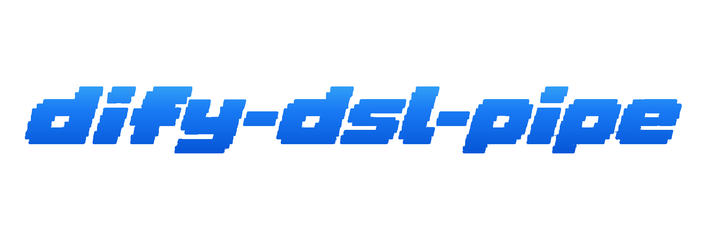

<p align="center">
  
</p>

<p align="center">
  <a href="README_EN.md"></a>
  <a href="https://www.npmjs.com/package/dify-dsl-pipe"></a>
  <a href="https://www.npmjs.com/package/dify-dsl-pipe"></a>
  <a href="LICENSE"></a>
  
</p>

Dify 应用 DSL 的一站式管道工具，涵盖导出、导入、备份、迁移、定时服务与 MCP Server 集成。

无需安装，通过 `npx` 命令即可直接使用。

---

## 功能特性

<table>
<tr><td><b>导出 & 备份</b></td><td>批量导出全部应用 DSL，支持按类型、标签、名称灵活过滤，并提供增量导出模式，只同步有变更的应用。</td></tr>
<tr><td><b>导入 & 迁移</b></td><td>从备份目录还原，或将应用跨实例迁移。提供预览模式（dry-run）和同名冲突策略，迁移前看清楚再执行。</td></tr>
<tr><td><b>多种存储后端</b></td><td>支持本地目录、Git 仓库（自动 commit）、以及 AWS S3 及所有 S3 兼容存储（阿里云 OSS / 腾讯 COS / 火山云 TOS / MinIO / Cloudflare R2）。</td></tr>
<tr><td><b>多实例管理</b></td><td>通过配置文件统一管理生产、测试、多租户等多套 Dify 环境，用 <code>--profile</code> 一键切换目标实例。</td></tr>
<tr><td><b>定时备份服务</b></td><td>serve 模式以轻量 HTTP API 服务运行，内置 cron 定时任务管理，支持 Slack、企业微信、钉钉等 Webhook 通知。</td></tr>
<tr><td><b>MCP Server</b></td><td>作为标准 MCP Server 暴露操作接口，Claude Code、Cursor、OpenCode 等 AI 工具可直接通过工具调用管理 Dify 应用。</td></tr>
<tr><td><b>版本自动适配</b></td><td>自动检测 Dify 版本并切换对应 Adapter，兼容 Legacy（0.6 ~ 0.15.3）和 Modern（1.0+），无需手动配置。</td></tr>
</table>

---

## 快速上手

### 方式一：命令行直接使用

无需安装，通过 `npx` 即可直接运行：

```bash
# 将所有应用导出到 ./dify-backup
npx dify-dsl-pipe export --url https://your-dify.com/console/api --token YOUR_TOKEN

# 也可以使用邮箱和密码认证
npx dify-dsl-pipe export --url https://your-dify.com/console/api \
  --email admin@example.com --password your-password

# 导入到目标实例（建议先以预览模式确认）
npx dify-dsl-pipe import --url https://target-dify.com/console/api --token TOKEN \
  --source ./dify-backup --dry-run

# 交互式初始化配置文件
npx dify-dsl-pipe init
```

> `--url` 需指向 Console API，地址以 `/console/api` 结尾。

### 方式二：通过 Agent Skill 使用

在支持 Skill 协议的 AI 工具（Claude Code、Cursor、OpenCode 等）中安装 Skill，通过显式调用驱动操作：

```bash
# 安装 Skill
npx skills add linhai0872/dify-dsl-pipe
```

安装后，在 AI 对话中用 `/dify-dsl-pipe` 显式唤起，然后描述你的需求：

> `/dify-dsl-pipe` 帮我把生产环境的所有 workflow 应用备份到本地，地址是 https://dify.example.com/console/api

Skill 会识别意图、补充缺失信息，并自动组装命令执行，全程无需手动输入参数。

---

## 文档

| 文档 | 内容 |
|------|------|
| [CLI 参数参考](docs/cli-reference.md) | export / import / serve 所有参数详表 |
| [存储后端配置](docs/storage.md) | local / git / MinIO / AWS S3 / Cloudflare R2 / 阿里云 OSS / 腾讯云 COS / 火山云 TOS |
| [配置文件参考](docs/config-file.md) | dify-pipe.yaml 完整字段说明 |
| [定时备份服务](docs/serve.md) | serve 模式、HTTP API 端点、cron 任务管理 |
| [MCP Server 集成](docs/mcp.md) | 配置 AI 工具直连 Dify |

---

## 多实例管理

运行 `npx dify-dsl-pipe init` 交互式创建，或手动建立 `dify-pipe.yaml`：

```yaml
instances:
  - name: prod
    url: "https://dify.prod.com/console/api"
    token: "prod-token"
  - name: staging
    url: "https://dify-staging.com/console/api"
    token: "staging-token"

profiles:
  prod:
    instance: prod
    storage:
      type: local
      path: "./backup/prod"
  staging:
    instance: staging
    storage:
      type: local
      path: "./backup/staging"
```

```bash
npx dify-dsl-pipe export --profile prod
npx dify-dsl-pipe import --profile staging --source ./backup/prod
```

---

## 从旧版迁移

原 Python 版（`dify-dsl-exporter`）用户：配置文件格式已完全变更，请运行 `npx dify-dsl-pipe init` 重新生成 `dify-pipe.yaml`。认证方式向下兼容，仍支持 email+password；存储后端统一为 `--storage s3 + --s3-endpoint`，各云厂商 endpoint 配置详见[存储后端文档](docs/storage.md)。

---

## License

MIT
